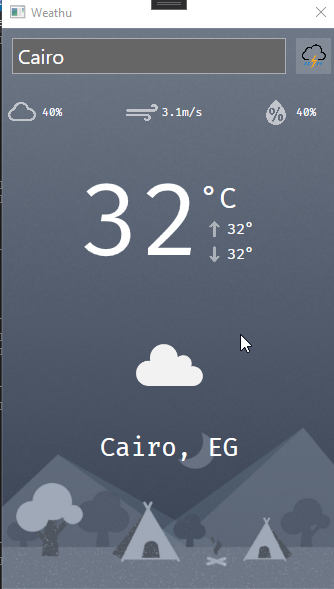

# Weathu
A Weather app I've built using WPF and .NET Core 5.0 by integrating with Open Weather API.

## How to use?
- Go a head to [Openweathermap](https://openweathermap.org/) 
- Create account
- Attach your `API_KEY` into the `Helper` class that can be found in view models.

## Screen Shot

